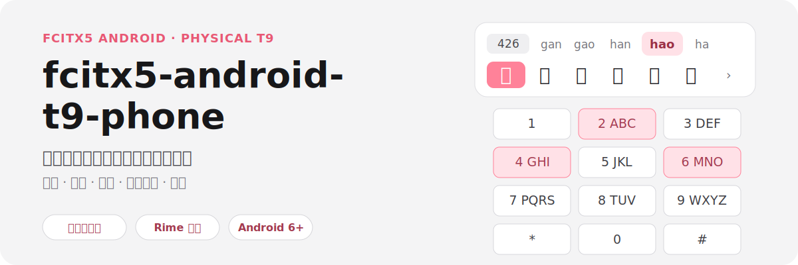
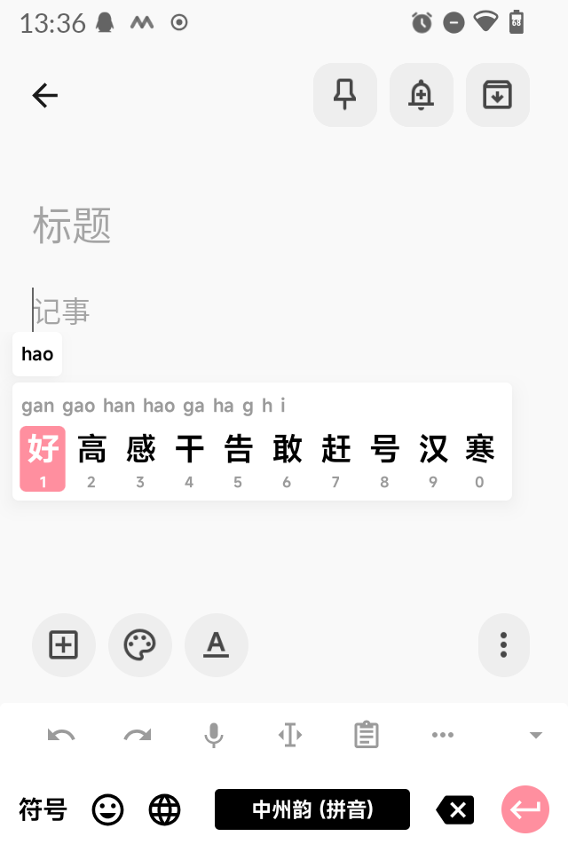

<p align="center">
  
</p>

<p align="center">
  <a href="https://github.com/Rizumu85/fcitx5-android-t9-phone/releases/latest">下载最新版</a> ·
  <a href="#下载与安装">安装教程</a> ·
  <a href="#九键按键规则">按键规则</a> ·
  <a href="#开发构建">开发构建</a>
</p>

面向物理九键安卓智能机和功能机的 Fcitx5 Android 输入法。它把实体数字键、方向键和确认键作为主要交互，提供拼音、笔画、注音、联想英语、手写和数字输入。

> [!NOTE]
> 项目主要维护物理九键体验。触摸全键盘及其他输入方式不是当前重点，可能存在兼容问题。

## 实际界面

<p align="center">
  
</p>

## 核心能力

- **中文九键**：拼音、笔画、注音三种方案，可分别设置默认简体或繁体输出。
- **英文九键**：普通 multi-tap 与联想英语 T9，支持下一词预测、本地词库学习和学习词管理。
- **中英文手写**：中文内置离线识别，也可下载 ML Kit 增强模型；英文模型下载后可完全离线使用。
- **物理键优先**：方向键选择候选、长按数字快捷选词；游戏和 Java 模拟器等非文本场景会透传键位。
- **小屏适配**：候选气泡、密码键盘、输入预览、文本选区、语音入口和可调整工具栏。
- **个性化**：自定义字体、主题，以及屏幕键和实体键按键音包。
- **无感词库部署**：安装输入法与 Rime 插件后自动下载、校验并启用匹配的九键配置；升级时仅在配置确实变化或损坏时处理。
- **统一更新**：在应用内分别检查输入法本体、Rime 插件和九键 Rime 配置更新。

## 下载与安装

### 1. 下载对应文件

从本项目的 [Releases](https://github.com/Rizumu85/fcitx5-android-t9-phone/releases) 下载与手机架构对应的两个 APK：

- 输入法本体：`org.fcitx.fcitx5.android-版本-架构-release.apk`
- Rime 插件：`org.fcitx.fcitx5.android.plugin.rime-版本-架构-release.apk`

32 位手机选择 `armeabi-v7a`，64 位手机选择 `arm64-v8a`。两个 APK 都需要安装。

### 2. 启用输入法

安装两个 APK，打开输入法本体并按引导启用。首次启动会自动选择 Rime，无需手动添加中州韵，也无需删除 English 或拼音输入法。输入法会在后台下载、校验并部署当前版本匹配的九键 Rime 配置；完成后会自动加载，不需要复制文件、点【重新部署】、点【同步】或来回切换系统输入法。

升级时，已经可用且版本匹配的配置会直接复用，不会重复部署。网络暂时不可用也不会破坏已有配置或反复弹错；首次安装尚未下载完成时，中文词库会显示正在准备。

<details>
<summary>仅在自动恢复持续失败时手动导入</summary>

从 [rime-ice-t9-phone Releases](https://github.com/Rizumu85/rime-ice-t9-phone/releases) 下载当前版本对应的 `rime-ice-t9-phone-main.zip`，解压后把其中所有文件和文件夹复制到：

```text
Android/data/org.fcitx.fcitx5.android/files/data/rime
```

然后在【词库切换】中点一次【重新部署】。配置部署与用户数据同步是两件事，恢复配置不需要点【同步】。

<p align="center">
  
</p>

</details>

可在【关于】->【检查更新】统一管理三类更新。打开设置时每天最多自动检查一次；网络不可用时不会反复弹出错误。

## 九键按键规则

### 中文：拼音、笔画与注音

在设置首页【中文输入方案】选择需要保留的方案，并分别设置默认简繁。启用多个方案后，空闲时长按 `*` 按“拼音 -> 笔画 -> 注音”循环；完整 Rime 方案输入法的快捷设置里【词库切换】进入。

| 按键 | 拼音九键 | 笔画九键 | 注音九键 |
| :--- | :--- | :--- | :--- |
| `1` | 拼音分词符号 `'` | 横 `一` | ㄅㄆㄇㄈ |
| `2` | ABC | 竖 `丨` | ㄉㄊㄋㄌ |
| `3` | DEF | 撇 `丿` | ㄍㄎㄏ |
| `4` | GHI | 点/捺 `丶` | ㄐㄑㄒ |
| `5` | JKL | 折 `乛` | ㄓㄔㄕㄖ |
| `6` | MNO | 未知笔画 `？` | ㄗㄘㄙ |
| `7` | PQRS | 不输入笔画 | ㄚㄛㄜㄝ |
| `8` | TUV | 不输入笔画 | ㄞㄟㄠㄡ |
| `9` | WXYZ | 不输入笔画 | ㄢㄣㄤㄥㄦ |
| `0` | 有候选时确认；空闲时空格 | 有候选时确认；空闲时空格 | ㄧㄨㄩ |

共同规则：

- 短按 `*` 打开中文符号，再按一次切换中英文符号。
- 符号第一页末尾的 `↵` 在支持的聊天输入框中发送消息，在其他输入框中插入换行。
- 输入编码时短按 `#` 提交上方显示的拼音、笔画或注音；空闲时短按 `#` 执行回车或搜索。
- 长按 `#` 切换中文、英文和数字模式。
- 有候选时长按 `1..9,0` 选择第 1 至 10 个候选；无候选时输入对应数字。
- OK/确认键提交当前候选。注音的 `0` 是输入键，因此使用 OK 确认。

默认简繁只在进入方案时应用一次；当前会话仍可通过 Rime 快捷选项临时切换。

### 英文

普通英文九键使用 multi-tap。在输入法上方【⋯】快捷设置中启用【联想英语】后，数字序列会预测单词，并在提交后继续显示下一词候选。

| 按键 | 短按 | 长按 |
| :--- | :--- | :--- |
| `1` | 切换 `abc / Abc / ABC` | 数字 1 / 第 1 个候选 |
| `2..9` | 对应字母组 | 对应数字 / 第 2 至 9 个候选 |
| `*` | 英文标点 | 字面量 `*` |
| `0` | 空格或确认候选并加空格 | 数字 0 / 第 10 个候选 |
| `#` | 提交当前英文后回车或搜索 | 切换中文、英文、数字模式 |

#### 学习新单词

1. 暂时关闭【联想英语】，用普通英文九键输入完整单词。
2. 用空格、标点或回车结束单词。
3. 再启用【联想英语】，输入对应数字序列即可看到新候选。

只学习两个字母以上的纯英文词；密码框和禁止个性化学习的输入框不会记录。误学内容可在【词库管理】->【联想英语学习词库】中搜索、编辑或删除。

### 数字

| 按键 | 短按 | 长按 |
| :--- | :--- | :--- |
| `1` | 1 | `-` |
| `2` | 2 | `+` |
| `3` | 3 | `=` |
| `4` | 4 | `π` |
| `5` | 5 | `/` |
| `6` | 6 | `≈` |
| `7` | 7 | `(` |
| `8` | 8 | `%` |
| `9` | 9 | `)` |
| `*` | `*` | 显示运算符提示 |
| `0` | 0 | `.` |
| `#` | 回车或搜索 | 切换中文、英文、数字模式 |

输入算式后长按 `3` 输入 `=`，或长按 `6` 输入 `≈`，可显示简单计算结果；按 OK/回车确认结果。

## 辅助输入

### 手写输入

在工具栏设置中启用【手写输入】后，可从输入法工具栏进入手写托盘：

- 中文手写无需下载即可使用内置离线识别；在【输入方式】中可另行下载 ML Kit 中文增强模型。
- 英文手写需要先下载 ML Kit 英文模型，下载完成后可完全离线使用；开启【联想英语】时也会提供英文预测候选。
- 支持钢笔和毛笔笔触、撤销笔画、候选确认、中文读音提示，以及表情、数字、符号、空格、逗号和回车等常用操作。
- 手写候选可用方向键移动、OK 或 `0` 确认；实体键 `1/4/7/*` 分别进入表情、数字、切换中英文手写和符号，`3/6/9` 分别执行退格、空格和逗号。

识别模型只需主动下载一次；下载失败可以在【输入方式】中重试，打开手写面板本身不会自动联网。

### 选区模式

长按 OK/确认键进入选区模式，用方向键扩展选区，再按 OK 打开操作面板：上复制、左剪切、右粘贴、下删除；返回或删除键取消。

### 密码模式与按键音

- 密码框会尽量自动切换到全键盘，也可从【⋯】手动开启密码模式。
- 输入预览和窥探功能可处理被键盘遮挡的密码框或验证码。
- 按键音支持内置声音和手动导入百度输入法 Android `.bds` 皮肤里的按键音；导入后可预览、改名、切换和删除。

## 开发构建

当前工具链版本以 [Versions.kt](build-logic/convention/src/main/kotlin/Versions.kt) 为准：Android SDK/Build Tools 36、NDK 28.0.13004108、CMake 3.31.6。Gradle 建议使用 Android Studio 自带的 JBR；原生构建还需要 `extra-cmake-modules` 和 GNU Gettext。

```shell
git clone --recurse-submodules https://github.com/Rizumu85/fcitx5-android-t9-phone.git
cd fcitx5-android-t9-phone

./gradlew :app:assembleDebug :plugin:rime:assembleDebug \
  -PbuildABI=arm64-v8a

./gradlew :app:testDebugUnitTest \
  -PbuildABI=arm64-v8a
```

- 实机 Debug、物理按键和 Rime 调试：[docs/t9-debugging.md](docs/t9-debugging.md)
- 最终冒烟测试：[docs/android-studio-final-test-workflow.md](docs/android-studio-final-test-workflow.md)
- 签名发布流程：[docs/release-runbook.md](docs/release-runbook.md)

## 许可证

本项目使用 [LGPL-2.1-or-later](LICENSE) 许可证。第三方组件及词库的许可信息可在应用【关于】->【开源许可证】中查看。
